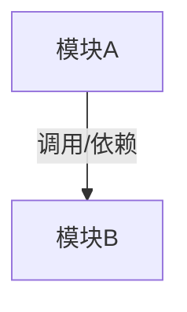

# <项目/模块名称> 导航地图

> <一句话概要说明>

---

## 核心模块索引

### 1. <模块名> ([相对路径](./path/))
- **核心职责**：<模块职责简述>
- **主入口**：[入口文件名](./path/to/file)

---

## 模块依赖与流向图

---

## 子地图指引

- [<子模块> 导航地图](./path/to/MAP.md) - <子模块描述>
