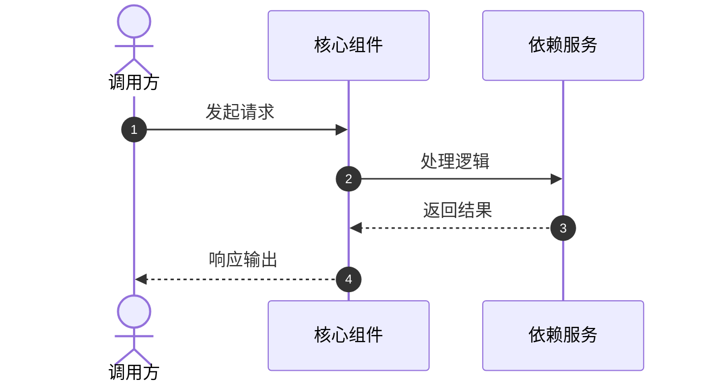

# <页面标题>

> <概要说明与责任边界>

---

## 核心职责与源码定位

- **核心职责**：<简述该模块/功能的定位与职责>
- **主要源码**：[<文件名>](file://<绝对路径>)
- **关键符号/API**：`<类名/函数名/符号>`

---

## 运行时流向与关系

---

## 不变式与异常处理

- **核心 Invariants**：<必须保证成立的规则与状态约束>
- **失败与重试**：<异常路径、清理逻辑与重试策略>

---

## 测试覆盖与验证

- **覆盖测试**：[<测试文件名>](file://<绝对路径>)
- **验证命令**：`<测试或构建命令>`
