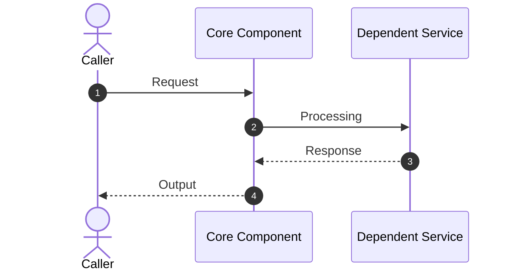

# <page title>

> 

---

## Core responsibilities and source locations

- **Core responsibilities**: <brief description of component/feature role>
- **Primary sources**: [<filename>](file://<absolute path>)
- **Key symbols/APIs**: `<class/function/symbol>`

---

## Runtime flow and relationships

---

## Invariants and error handling

- **Core Invariants**: <rules and state constraints that must hold true>
- **Failures and retries**: <error paths, cleanup logic, and retry strategies>

---

## Test coverage and verification

- **Test coverage**: [<test file>](file://<absolute path>)
- **Verification command**: `<test or build command>`
