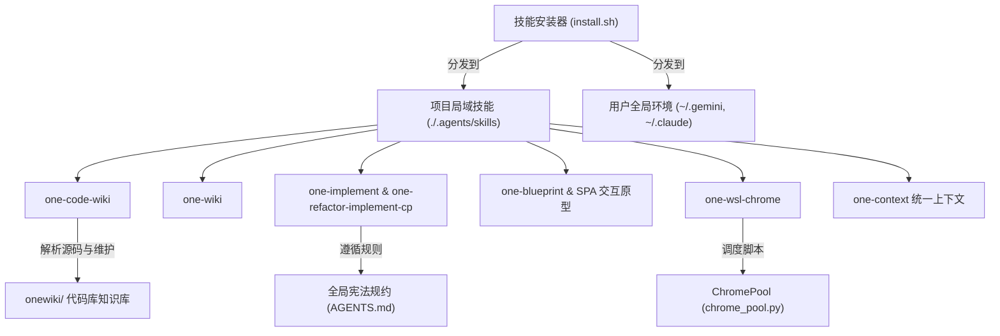

# one-skills 架构与 Code Wiki 导航

`one-skills` 是一个模块化 AI Agent 技能与工作流管理仓库，包含各种面向开发、文档、图表生成、AI 编码与环境集成的 Skill 定义、安装管理脚本及代理规则。

## 系统架构与核心模块

整个仓库由以下四大核心板块构成：

### 1. 技能管理与分发核心 (Core Installer)
- [技能安装与管理系统](file://$github_dir/one-skills/onewiki/core/skill-installer.md)：通过 [`install.sh`](file://$github_dir/one-skills/install.sh) 和 [`install-others.sh`](file://$github_dir/one-skills/install-others.sh) 实现 Skills 独立模块及全局规则向项目本地 (`./.agents/skills`) 和用户全局环境 (`~/.gemini/config/skills`, `~/.claude/skills` 等) 的交互式分发与协同。

### 2. 双 Wiki 知识库系统 (Wiki Systems)
- [Code Wiki 源码知识库](file://$github_dir/one-skills/onewiki/wiki-systems/code-wiki.md)：由 [`one-code-wiki`](file://$github_dir/one-skills/one-code-wiki/SKILL.md) 驱动，实现以源码和测试为凭据的轻量级、确定性代码库 Wiki 增量摄入与维护 (`ingest`, `query`, `lint`)。
- [LLM Wiki 纯 Prompt 知识库](file://$github_dir/one-skills/onewiki/wiki-systems/llm-wiki.md)：由 [`one-wiki`](file://$github_dir/one-skills/one-wiki/SKILL.md) 驱动，为 `$one_llmwiki_dir/` 个人通用知识库提供纯 Prompt 的无代码编排、Obsidian 双链、长文档解析与检索问答体系。
### 3. AI 开发与设计工作流 (Workflows)
- [代码实现与重构工作流](file://$github_dir/one-skills/onewiki/workflows/implementation-workflows.md)：包含 [`one-implement`](file://$github_dir/one-skills/one-implement/SKILL.md) 与 [`one-refactor-implement-cp`](file://$github_dir/one-skills/one-refactor-implement-cp/SKILL.md)，架构者派发、CP 物理剪贴板与代码-蓝图强同步机制。
- [需求交互与架构规划工作流](file://$github_dir/one-skills/onewiki/workflows/design-planning-workflows.md)：涵盖 SPA 可交互单页原型、[`one-blueprint`](file://$github_dir/one-skills/one-blueprint/SKILL.md) 业务活蓝图与 [`one-handoff`](file://$github_dir/one-skills/one-handoff/SKILL.md)，负责以 SPA 原型验证交互体验与沉淀业务活蓝图。
- [统一上下文与项目记忆](file://$github_dir/one-skills/one-context/SKILL.md)：通过 [`one-context`](file://$github_dir/one-skills/one-context/SKILL.md) 维护项目全局上下文文件 (`one-context.md` / `CONTEXT.md`)，沉淀架构意图、设计决策与模块位置，赋能 Agent 跨会话理解。

### 4. 跨环境集成 (Integrations)
- [WSL Chrome 自动化集成](file://$github_dir/one-skills/onewiki/integrations/wsl-chrome.md)：由 [`one-wsl-chrome`](file://$github_dir/one-skills/one-wsl-chrome/SKILL.md) 与 [`chrome_pool.py`](file://$github_dir/one-skills/one-wsl-chrome/scripts/chrome_pool.py) 构成，通过 Playwright CDP 跨越 WSL/Windows 边界控制宿主机 Chrome 浏览器。

## 领域概念依赖拓扑

