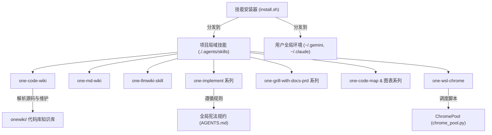

# one-skills 架构与 Code Wiki 导航

`one-skills` 是一个模块化 AI Agent 技能与工作流管理仓库，包含各种面向开发、文档、图表生成、AI 编码与环境集成的 Skill 定义、安装管理脚本及代理规则。

## 系统架构与核心模块

整个仓库由以下四大核心板块构成：

### 1. 技能管理与分发核心 (Core Installer)
- [技能安装与管理系统](file://$github_dir/one-skills/onewiki/core/skill-installer.md)：通过 [`install.sh`](file://$github_dir/one-skills/install.sh) 和 [`install-others.sh`](file://$github_dir/one-skills/install-others.sh) 实现 Skills 独立模块及全局规则向项目本地 (`./.agents/skills`) 和用户全局环境 (`~/.gemini/config/skills`, `~/.claude/skills` 等) 的交互式分发与协同。

### 2. 三大 Wiki 知识库系统 (Wiki Systems)
- [Code Wiki 源码知识库](file://$github_dir/one-skills/onewiki/wiki-systems/code-wiki.md)：由 [`one-code-wiki`](file://$github_dir/one-skills/one-code-wiki/SKILL.md) 驱动，实现以源码和测试为凭据的轻量级、确定性代码库 Wiki 增量摄入与维护 (`ingest`, `query`, `lint`)。
- [Markdown Wiki 个人文档库](file://$github_dir/one-skills/onewiki/wiki-systems/md-wiki.md)：由 [`one-md-wiki`](file://$github_dir/one-skills/one-md-wiki/SKILL.md) 驱动，聚焦个人通用 Markdown 知识库的结构化组织与一致性校验。
- [LLM Wiki 纯 Prompt 无代码知识库](file://$github_dir/one-skills/onewiki/wiki-systems/llm-wiki.md)：由 [`one-llmwiki-skill`](file://$github_dir/one-skills/one-llmwiki-skill/SKILL.md) 驱动，为 `$one-llmwiki_dir/` 提供纯 Prompt 的无代码编排巡检与检索问答体系。

### 3. AI 开发与设计工作流 (Workflows)
- [代码实现与精简工作流](file://$github_dir/one-skills/onewiki/workflows/implementation-workflows.md)：包含 [`one-implement`](file://$github_dir/one-skills/one-implement/SKILL.md)、[`one-minimal-implement`](file://$github_dir/one-skills/one-minimal-implement/SKILL.md)、[`one-refactor-implement`](file://$github_dir/one-skills/one-refactor-implement/SKILL.md) 和 [`one-simplifying`](file://$github_dir/one-skills/one-simplifying/SKILL.md)，严格受暗号控制与至简原则驱动的代码修改闭环。
- [需求讨论与设计规划工作流](file://$github_dir/one-skills/onewiki/workflows/design-planning-workflows.md)：涵盖 [`one-grill-with-docs-prd`](file://$github_dir/one-skills/one-grill-with-docs-prd/SKILL.md)、[`one-build-blueprint`](file://$github_dir/one-skills/one-build-blueprint/SKILL.md) 和 [`one-handoff`](file://$github_dir/one-skills/one-handoff/SKILL.md)，负责需求 Clarification、PRD 产出、架构蓝图绘制与交接文档生成。
- [结构映射与可视化工作流](file://$github_dir/one-skills/onewiki/workflows/structure-visualization.md)：集成了 [`one-code-map`](file://$github_dir/one-skills/one-code-map/SKILL.md)、[`one-build-mermaid`](file://$github_dir/one-skills/one-build-mermaid/SKILL.md)、[`one-build-drawio`](file://$github_dir/one-skills/one-build-drawio/SKILL.md) 与 [`one-python-structure`](file://$github_dir/one-skills/one-python-structure/SKILL.md)，负责架构图表自动化与标准子项目结构推行。

### 4. 跨环境集成 (Integrations)
- [WSL Chrome 自动化集成](file://$github_dir/one-skills/onewiki/integrations/wsl-chrome.md)：由 [`one-wsl-chrome`](file://$github_dir/one-skills/one-wsl-chrome/SKILL.md) 与 [`chrome_pool.py`](file://$github_dir/one-skills/one-wsl-chrome/scripts/chrome_pool.py) 构成，通过 Playwright CDP 跨越 WSL/Windows 边界控制宿主机 Chrome 浏览器。

## 领域概念依赖拓扑

