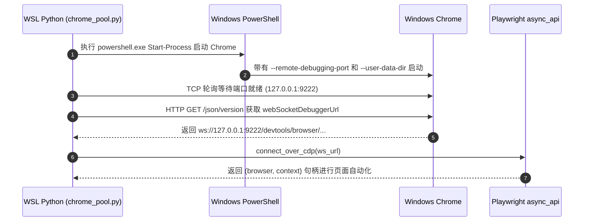

# WSL Chrome 自动化集成

在 WSL (Windows Subsystem for Linux) 环境下，缺乏原生 Linux GUI Chrome，导致标准的 Playwright/Selenium 自动化脚本无法正常工作。`one-wsl-chrome` 方案通过 CDP (Chrome DevTools Protocol) 实现了从 WSL Python 环境直接控制 Windows 宿主机 Chrome 浏览器。

## 架构与主要文件

- [`one-wsl-chrome/SKILL.md`](file://$github_dir/one-skills/one-wsl-chrome/SKILL.md)：Skill 规则定义，明确触发场景（如需自动化浏览器、提取登录 Cookie、规避机器人检测等）。
- [`chrome_pool.py`](file://$github_dir/one-skills/one-wsl-chrome/scripts/chrome_pool.py)：核心连接池 Python 类 `ChromePool`。

## 关键实现细节

1. **PowerShell 进程拉起**：使用 `/mnt/c/Windows/System32/WindowsPowerShell/v1.0/powershell.exe` 调用 `Start-Process`，在 Windows 侧启动 `C:\Program Files\Google\Chrome\Application\chrome.exe`。
2. **调试端口与 User Data Dir**：传递参数 `--remote-debugging-port=<port>` 与 `--user-data-dir=C:\tmp\chrome_profiles\profile_<index>`。
3. **CDP 连接与 WS 轮询**：通过 HTTP 访问 `http://127.0.0.1:<port>/json/version` 获取 `webSocketDebuggerUrl`，再通过 Playwright `connect_over_cdp(ws_url)` 建立长连接。

## 运行交互时序

## 相关知识库关系

- [技能安装与管理系统](file://$github_dir/one-skills/onewiki/core/skill-installer.md) 将 `one-wsl-chrome` 部署至应用环境。
