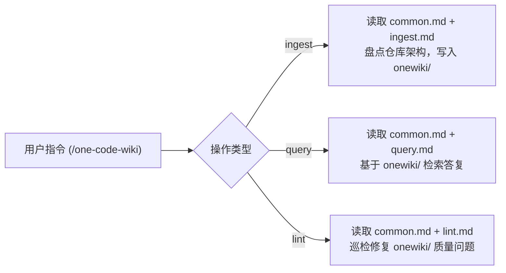

# Code Wiki 源码知识库系统

`one-code-wiki` 是本仓库提供的一个专门针对代码仓库进行结构化 Wiki 维护与检索的 AI 技能。它在 `onewiki/` 目录下构建并维护以源码和真实测试为唯一凭据的知识库。

## 模块结构与约定

Skill 定义文件位于 [`one-code-wiki/SKILL.md`](file:///home/pengbo/home/github/one-skills/one-code-wiki/SKILL.md)，其引用的核心规范文件保存在 `one-code-wiki/references/` 目录下：

- [`common.md`](file:///home/pengbo/home/github/one-skills/one-code-wiki/references/common.md)：定义跨所有操作的共享契约。包括证据与范围约束、文档目标、语义链接模型、OKF v0.1 frontmatter 格式规范、Mermaid 图表校验及完成检查项。
- [`ingest.md`](file:///home/pengbo/home/github/one-skills/one-code-wiki/references/ingest.md)：控制 Wiki 的初始化（Bootstrap）与增量摄入（Incremental）。在初始状态生成全库盘点表；在存在现有文档时通过分析 Git diff 实施单跳依赖扩展更新。
- [`query.md`](file:///home/pengbo/home/github/one-skills/one-code-wiki/references/query.md)：提供以 Wiki 索引为入口的精确问答与路径追踪导引。
- [`lint.md`](file:///home/pengbo/home/github/one-skills/one-code-wiki/references/lint.md)：提供语义一致性、死链接、缺失 frontmatter 及失效断言的质量巡检规范。

## 核心操作与流程

## 约束与规范

1. **唯一产物路径**：所有生成的 Wiki 页面必须且只能存在于 `onewiki/` 目录下。
2. **OKF 规范**：每个非 `index.md` 页面必须包含有效的 OKF v0.1 YAML frontmatter（包含 `type`、`title`、`description` 等字段）。
3. **事实准则**：严禁凭空构想未在源码或测试中出现的 symbol、路径或功能，遇到信息不足必须显式标注证据限制。

## 相关知识库关系

- [技能安装与管理系统](file:///home/pengbo/home/github/one-skills/onewiki/core/skill-installer.md) 负责将 `one-code-wiki` 部署至应用环境。
- [Markdown Wiki 个人文档库](file:///home/pengbo/home/github/one-skills/onewiki/wiki-systems/md-wiki.md) 处理非代码仓库的通用 Markdown 文档体系。
- [LLM Wiki 纯 Prompt 知识库](file:///home/pengbo/home/github/one-skills/onewiki/wiki-systems/llm-wiki.md) 关注全自动无代码纯 Prompt 知识库积累。
