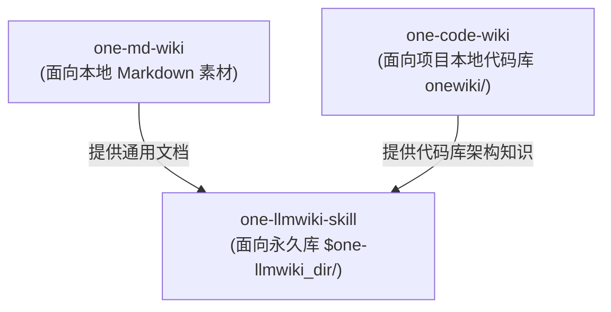

# LLM Wiki 纯 Prompt 无代码知识库系统

`one-llmwiki-skill` 实现了纯 Prompt 驱动的全功能无代码 Wiki 知识库体系，专门服务于个人唯一永久知识库仓库（默认路径 `$one-llmwiki_dir/`）。

## 核心架构与功能模块

Skill 入口位于 [`one-llmwiki-skill/SKILL.md`](file://$github_dir/one-skills/one-llmwiki-skill/SKILL.md)，包含四大 Prompt 编排组件：

1. **素材摄入与增量编译 (Ingest & Compile)**：把日常对话、聊天记录或离线 Markdown/PDF/Web 提取素材无缝编译入统一 Wiki 体系。
2. **语义 Lint 巡检 (Semantic Lint)**：自动扫描元数据缺失、矛盾事实、重复定义及断裂指针。
3. **Wiki 问答检索 (Retrieval & QA)**：支持基于全局索引的高质量多跳推理问答。
4. **长文档大纲推理 (Long Doc Analysis)**：长文本全貌大纲提取与知识结构映射。

支持模板定义见 [`okf-template.md`](file://$github_dir/one-skills/one-llmwiki-skill/references/okf-template.md)。

## 与其他 Wiki 系统的协作

## 相关知识库关系

- [Code Wiki 源码知识库](file://$github_dir/one-skills/onewiki/wiki-systems/code-wiki.md) 专注当前 repository 代码维度的 Wiki。
- [Markdown Wiki 个人文档库](file://$github_dir/one-skills/onewiki/wiki-systems/md-wiki.md) 处理通用 Markdown 内容。
