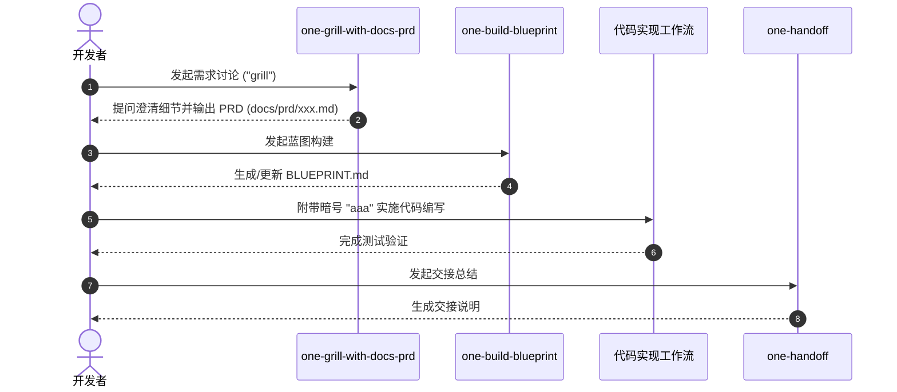

# 需求讨论与设计规划工作流

在进行任何复杂的编码之前，需求讨论与设计规划工作流确保 AI 与开发者在需求边界、技术方案和交付标准上达成一致。

## 组成技能与职责

1. [`one-grill-with-docs-prd`](file://$github_dir/one-skills/one-grill-with-docs-prd/SKILL.md)：需求澄清与 PRD 生成技能（触发词："讨论需求"、"grill" 或 "prd"）。通过多轮交互提问对需求做全面对齐，并在 `docs/prd/` 目录下生成标准 PRD。
2. [`one-build-blueprint`](file://$github_dir/one-skills/one-build-blueprint/SKILL.md)：架构蓝图构建技能。参考 [`BLUEPRINT-TEMPLATE.md`](file://$github_dir/one-skills/one-build-blueprint/BLUEPRINT-TEMPLATE.md) 编写根目录下的 `BLUEPRINT.md`，确立全局架构原则与技术栈边界。
3. [`one-handoff`](file://$github_dir/one-skills/one-handoff/SKILL.md)：任务交接技能。在开发任务阶段性结束或交接给下一位协同人员时，生成清晰的上下文、改动摘要与未尽事项文档。

## 工作流转换

## 相关知识库关系

- [代码实现与精简工作流](file://$github_dir/one-skills/onewiki/workflows/implementation-workflows.md) 消费本流程产出的 PRD 和蓝图指导代码编写。
- [结构映射与可视化工作流](file://$github_dir/one-skills/onewiki/workflows/structure-visualization.md) 协助生成蓝图和 PRD 中的架构视图。
