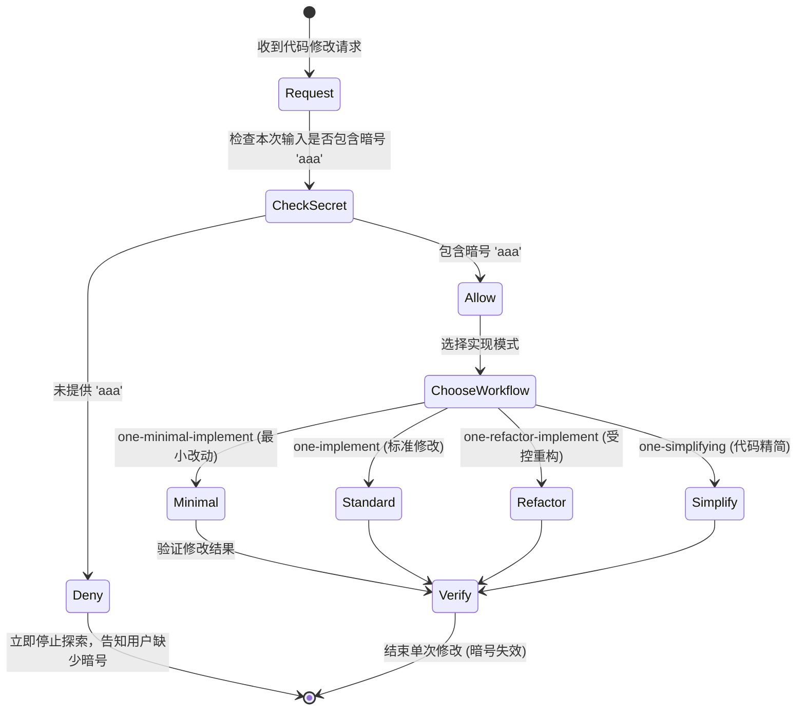

# 代码实现与精简工作流

代码实现工作流族是 `one-skills` 中最严格的指令执行体系。所有的代码改动均受 [AI 编码宪法规约](file:///home/pengbo/home/github/one-skills/AGENTS.md) 约束，防范投机性抽象与过度防御代码。

## 组成技能与职责

1. [`one-implement`](file:///home/pengbo/home/github/one-skills/one-implement/SKILL.md)：标准代码修改工作流。**触发前提**：用户提示词中必须包含暗号 `aaa`（且每次仅单次生效）。在实施任何改动前，先确认暗号与规划。
2. [`one-minimal-implement`](file:///home/pengbo/home/github/one-skills/one-minimal-implement/SKILL.md)：极简实现工作流。拒绝任何未明确要求的功能、错误处理或配置化扩展，能用一行代码解决绝不写两行。
3. [`one-refactor-implement`](file:///home/pengbo/home/github/one-skills/one-refactor-implement/SKILL.md)：重构工作流。严格物理复制现有代码，非修改区保持 100% 绝对禁触，确保重构前后的测试都能通过。
4. [`one-simplifying`](file:///home/pengbo/home/github/one-skills/one-simplifying/SKILL.md)：精简优化工作流。主动砍掉“以防万一”的防御性校验、兜底方案和未使用的依赖引用。

## 执行约束与控制流

## 核心法则

- **拒绝防御性代码**：确定的路径与文件不得使用 `[ -f ]` 或 `command -v` 进行二次防御检查。
- **拒绝兜底方案**：A 方案能用就用 A，报错直接修复 A，绝不去编写 B 方案来兜底。
- **物理复制优先**：涉及已有代码迁移、重构或修改时，必须通过命令行 `cp`/`mv`/`cat` 操作，严禁读完凭记忆生成。

## 相关知识库关系

- [技能安装与管理系统](file:///home/pengbo/home/github/one-skills/onewiki/core/skill-installer.md) 管理本工作流技能在各环境的安装。
- [需求讨论与设计规划工作流](file:///home/pengbo/home/github/one-skills/onewiki/workflows/design-planning-workflows.md) 在编码实施之前提供 PRD 和架构蓝图输入。
