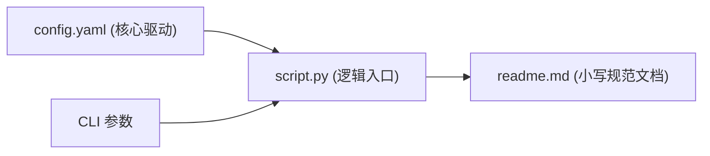

# 结构映射与可视化工作流

本工作流为代码库提供结构映射、图表可视化与标准化项目文件排版的辅助能力。

## 组成技能与职责

1. [`one-build-map`](file:///home/pengbo/home/github/one-skills/one-build-map/SKILL.md)：基于模板 [`MAP-TEMPLATE.md`](file:///home/pengbo/home/github/one-skills/one-build-map/MAP-TEMPLATE.md) 扫瞄代码库并建立根目录 `MAP.md` 文件索引。
2. [`one-update-maps`](file:///home/pengbo/home/github/one-skills/one-update-maps/SKILL.md)：增量更新代码库文件 map 索引，保持 `MAP.md` 与当前文件树实时同步。
3. [`one-build-mermaid`](file:///home/pengbo/home/github/one-skills/one-build-mermaid/SKILL.md)：基于模板 [`GRAPH-TEMPLATE.md`](file:///home/pengbo/home/github/one-skills/one-build-mermaid/GRAPH-TEMPLATE.md) 生成标准 Mermaid 时序图、状态机或流程图。
4. [`one-build-drawio`](file:///home/pengbo/home/github/one-skills/one-build-drawio/SKILL.md)：生成与编辑 Draw.io 格式架构图（如根目录下的 [`skills.drawio`](file:///home/pengbo/home/github/one-skills/skills.drawio)）。
5. [`one-python-structure`](file:///home/pengbo/home/github/one-skills/one-python-structure/SKILL.md)：推行每个子项目的标准三件套结构（`<script.py>` + `config.yaml` + `readme.md`），以 YAML 配置为核心驱动并保留 CLI 参数支持。

## 标准三件套规范示意

## 相关知识库关系

- [Code Wiki 源码知识库](file:///home/pengbo/home/github/one-skills/onewiki/wiki-systems/code-wiki.md) 借助本工作流生成的图表与 MAP 文件来加速代码分析与链路追踪。
- [需求讨论与设计规划工作流](file:///home/pengbo/home/github/one-skills/onewiki/workflows/design-planning-workflows.md) 在设计阶段嵌入可视化图表。
